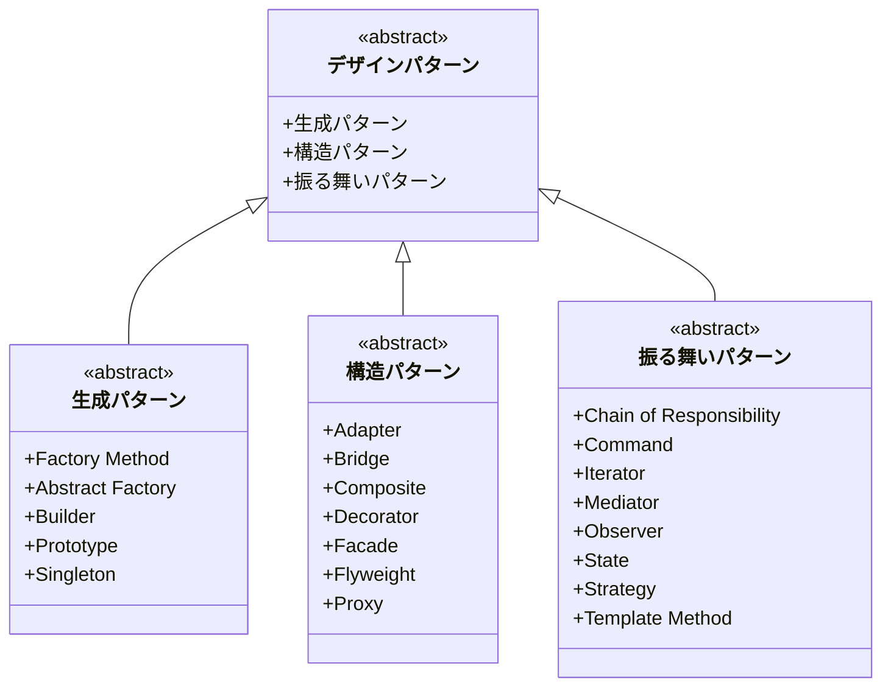
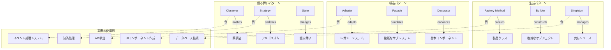

# design-pattern

# デザインパターン解説ドキュメント

## 1. デザインパターンの基本構造

以下の図は、デザインパターンの基本的な分類と構造を示しています：

## 2. デザインパターンの実践的な使用例と関係性

以下の図は、各パターンの具体的な使用例と相互関係を示しています：

## 3. 各パターンの詳細な使用例

### 生成パターン

- **Factory Method**

  - UI コンポーネントの生成
  - データベースコネクションの作成
  - ドキュメントフォーマットの生成

- **Singleton**
  - データベース接続プール
  - 設定管理
  - キャッシュ管理

### 構造パターン

- **Adapter**

  - レガシーシステムとの統合
  - 外部 API の統合
  - 異なるフォーマット間の変換

- **Facade**
  - 複雑なライブラリのラッパー
  - マイクロサービスのフロントエンド
  - 統合認証システム

### 振る舞いパターン

- **Observer**

  - イベント処理システム
  - ユーザーインターフェースの更新
  - プッシュ通知システム

- **Strategy**
  - 決済処理の切り替え
  - ソートアルゴリズムの選択
  - 認証方式の切り替え

## 4. 実装時の注意点

1. **適切なパターンの選択**

   - プロジェクトの規模に応じた選択
   - チームの経験レベルの考慮
   - 将来の拡張性の検討

2. **パターンの組み合わせ**

   - 複数のパターンの効果的な組み合わせ
   - パターン間の相互作用の理解
   - 適切な粒度の設定

3. **パフォーマンスの考慮**
   - オーバーヘッドの評価
   - メモリ使用量の最適化
   - 処理速度への影響

# デザインパターンの実践的な使用例と適用シーン

## 1. 生成に関するパターン

### Factory パターン

- **主な用途**: フレームワークやライブラリの開発
- **具体例**:
  - データベースドライバーの切り替え（MySQL, PostgreSQL, SQLite）
  - ドキュメント生成システム（PDF, Word, HTML 形式の出力）
  - UI コンポーネントの生成（異なるプラットフォーム向けのボタン、フォーム）

### Builder パターン

- **主な用途**: 複雑なオブジェクトの段階的構築
- **具体例**:
  - API リクエストビルダー
  - 複雑な SQL 文の構築
  - カスタマイズ可能な製品の注文システム

### Singleton パターン

- **主な用途**: グローバルな状態管理、リソースの共有
- **具体例**:
  - データベース接続プール
  - アプリケーション設定
  - ロギングシステム

## 2. 構造に関するパターン

### Adapter パターン

- **主な用途**: 異なるインターフェース間の互換性確保
- **具体例**:
  - レガシーシステムと新システムの統合
  - サードパーティ API の統合
  - 異なる決済システムの統一的な扱い

### Facade パターン

- **主な用途**: 複雑なサブシステムの簡素化
- **具体例**:
  - マイクロサービスのフロントエンド統合
  - 複雑なライブラリのラッパー作成
  - 統合認証システム

## 3. 振る舞いに関するパターン

### Observer パターン

- **主な用途**: イベント駆動型システム
- **具体例**:
  - リアルタイムデータ更新（株価表示など）
  - UI イベントハンドリング
  - プッシュ通知システム

### Strategy パターン

- **主な用途**: アルゴリズムの動的切り替え
- **具体例**:
  - 支払い方法の切り替え（クレジットカード、PayPal、銀行振込）
  - データ圧縮アルゴリズムの切り替え
  - ソート方法の動的選択

### Command パターン

- **主な用途**: 処理の抽象化とキューイング
- **具体例**:
  - Undo/Redo 機能の実装
  - バッチ処理システム
  - トランザクション管理

## 実装時の注意点

1. **過剰な適用を避ける**

   - 小規模な機能に対して複雑なパターンを適用すると、かえってコードが複雑になる
   - 将来の拡張性を考慮しつつ、現在の要件に適した選択をする

2. **パターンの組み合わせ**

   - 複数のパターンを組み合わせることで、より柔軟なシステムを構築できる
   - 例：Factory パターンと Strategy パターンの組み合わせによる柔軟なオブジェクト生成と振る舞いの制御

3. **コンテキストの重要性**
   - プロジェクトの規模、チームの経験、保守性要件などを考慮してパターンを選択する
   - パフォーマンスへの影響も考慮に入れる
