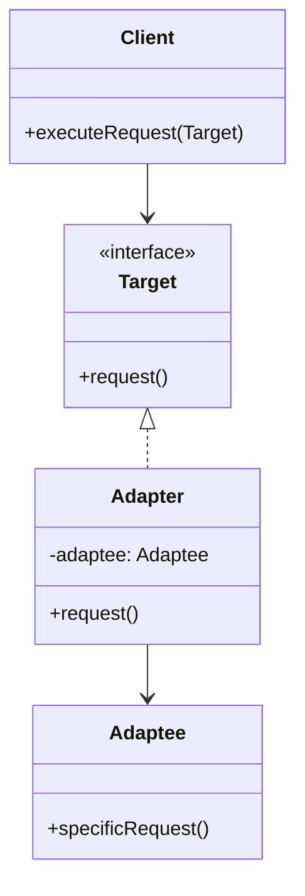
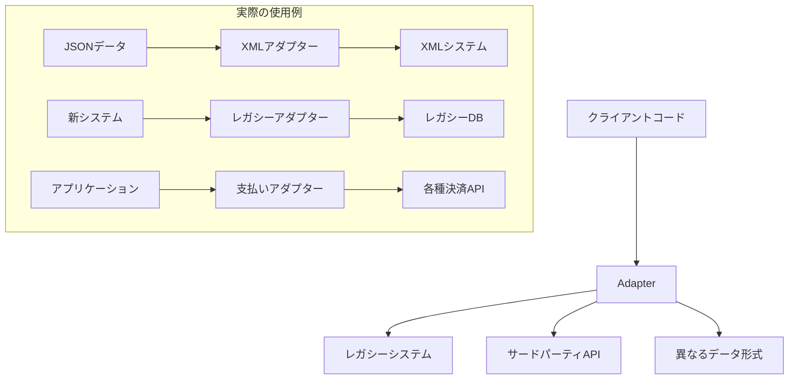

# Adapter パターン

## 1. 基本構造



## 2. ユースケース図



## 3. TypeScript 実装例

### 3.1 基本的なアダプターパターン

```typescript
// Target（ターゲット）インターフェース
interface Target {
  request(): string;
}

// Adaptee（適合される側）のクラス
class Adaptee {
  public specificRequest(): string {
    return "Specific request from Adaptee";
  }
}

// Adapter（アダプター）クラス
class Adapter implements Target {
  private adaptee: Adaptee;

  constructor(adaptee: Adaptee) {
    this.adaptee = adaptee;
  }

  public request(): string {
    const result = this.adaptee.specificRequest();
    return `Adapter: (TRANSLATED) ${result}`;
  }
}

// クライアントコード
class Client {
  public static execute(target: Target) {
    console.log(target.request());
  }
}

// 使用例
const adaptee = new Adaptee();
const adapter = new Adapter(adaptee);
Client.execute(adapter);
```

### 3.2 データ形式変換の実践例

```typescript
// 異なるデータ形式のインターフェース
interface JSONData {
  name: string;
  age: number;
  email: string;
}

interface XMLData {
  toXML(): string;
}

// JSONからXMLへのアダプター
class JSONtoXMLAdapter implements XMLData {
  private jsonData: JSONData;

  constructor(jsonData: JSONData) {
    this.jsonData = jsonData;
  }

  public toXML(): string {
    return `
            <?xml version="1.0" encoding="UTF-8"?>
            <person>
                <name>${this.jsonData.name}</name>
                <age>${this.jsonData.age}</age>
                <email>${this.jsonData.email}</email>
            </person>
        `.trim();
  }
}

// 使用例
const jsonData: JSONData = {
  name: "John Doe",
  age: 30,
  email: "john@example.com",
};

const xmlAdapter = new JSONtoXMLAdapter(jsonData);
console.log(xmlAdapter.toXML());
```

### 3.3 支払い処理の実践例

```typescript
// 共通の支払いインターフェース
interface PaymentProcessor {
  processPayment(amount: number): Promise<boolean>;
  getBalance(): Promise<number>;
}

// PayPal APIのモック
class PayPalAPI {
  async makePayment(sum: number): Promise<string> {
    return `PayPal payment of ${sum} processed`;
  }

  async checkBalance(): Promise<string> {
    return `1000`;
  }
}

// Stripeのモック
class StripeAPI {
  async createCharge(amount: number): Promise<boolean> {
    return true;
  }

  async getAccountBalance(): Promise<number> {
    return 1000;
  }
}

// PayPalアダプター
class PayPalAdapter implements PaymentProcessor {
  private paypal: PayPalAPI;

  constructor() {
    this.paypal = new PayPalAPI();
  }

  async processPayment(amount: number): Promise<boolean> {
    const result = await this.paypal.makePayment(amount);
    return result.includes("processed");
  }

  async getBalance(): Promise<number> {
    const balance = await this.paypal.checkBalance();
    return parseInt(balance);
  }
}

// Stripeアダプター
class StripeAdapter implements PaymentProcessor {
  private stripe: StripeAPI;

  constructor() {
    this.stripe = new StripeAPI();
  }

  async processPayment(amount: number): Promise<boolean> {
    return await this.stripe.createCharge(amount);
  }

  async getBalance(): Promise<number> {
    return await this.stripe.getAccountBalance();
  }
}

// 使用例
async function processPaymentWithProvider(
  processor: PaymentProcessor,
  amount: number
) {
  const success = await processor.processPayment(amount);
  if (success) {
    const balance = await processor.getBalance();
    console.log(`Payment processed. New balance: ${balance}`);
  }
}

// 異なる決済プロバイダーを統一的に使用
const paypalProcessor = new PayPalAdapter();
const stripeProcessor = new StripeAdapter();

processPaymentWithProvider(paypalProcessor, 100);
processPaymentWithProvider(stripeProcessor, 100);
```

## 4. 主なユースケース

1. **異なるデータ形式の変換**

   - JSON ⇔ XML
   - CSV ⇔ JSON
   - バイナリ ⇔ テキスト

2. **レガシーシステムの統合**

   - 古い API の新システムへの適合
   - データベースインターフェースの統一
   - プロトコルの変換

3. **サードパーティライブラリの統合**
   - 決済システム
   - 認証サービス
   - 外部 API の統合

## 5. メリット

1. **柔軟性と再利用性**

   - 互換性のないクラスの統合
   - 既存コードの再利用
   - システムの段階的な更新

2. **保守性**
   - インターフェースの標準化
   - 依存関係の制御
   - コードの整理整頓

## 6. 実装時の注意点

1. **インターフェース設計**

   - 必要最小限のメソッドを定義
   - 明確な責任範囲の設定
   - 一貫性のある命名規則

2. **エラーハンドリング**

```typescript
class SafeAdapter implements Target {
  private adaptee: Adaptee;

  constructor(adaptee: Adaptee) {
    this.adaptee = adaptee;
  }

  public request(): string {
    try {
      const result = this.adaptee.specificRequest();
      return `Adapter: ${result}`;
    } catch (error) {
      console.error("Adapter error:", error);
      return "Adapter: Error occurred during adaptation";
    }
  }
}
```

3. **パフォーマンスの考慮**
   - 変換処理のコスト
   - キャッシュの利用
   - 非同期処理の適切な実装

```typescript
class CachedAdapter implements Target {
  private adaptee: Adaptee;
  private cache: Map<string, string>;

  constructor(adaptee: Adaptee) {
    this.adaptee = adaptee;
    this.cache = new Map();
  }

  public request(): string {
    const cacheKey = "request";
    if (this.cache.has(cacheKey)) {
      return this.cache.get(cacheKey)!;
    }

    const result = this.adaptee.specificRequest();
    this.cache.set(cacheKey, result);
    return result;
  }
}
```

## 7. 発展的なトピック

1. **双方向アダプター**

```typescript
class TwoWayAdapter implements NewInterface, OldInterface {
  private newSystem: NewSystem;
  private oldSystem: OldSystem;

  constructor(newSystem: NewSystem, oldSystem: OldSystem) {
    this.newSystem = newSystem;
    this.oldSystem = oldSystem;
  }

  // NewInterface implementation
  public newRequest(): string {
    return this.oldSystem.oldRequest();
  }

  // OldInterface implementation
  public oldRequest(): string {
    return this.newSystem.newRequest();
  }
}
```

2. **複数のアダプターの管理**

```typescript
class AdapterRegistry {
  private adapters: Map<string, Target>;

  constructor() {
    this.adapters = new Map();
  }

  public registerAdapter(name: string, adapter: Target): void {
    this.adapters.set(name, adapter);
  }

  public getAdapter(name: string): Target {
    const adapter = this.adapters.get(name);
    if (!adapter) {
      throw new Error(`Adapter ${name} not found`);
    }
    return adapter;
  }
}
```

このように、Adapter パターンは異なるインターフェース間の互換性を確保する強力なツールとなります。適切に使用することで、システムの柔軟性と保守性を大きく向上させることができます。
