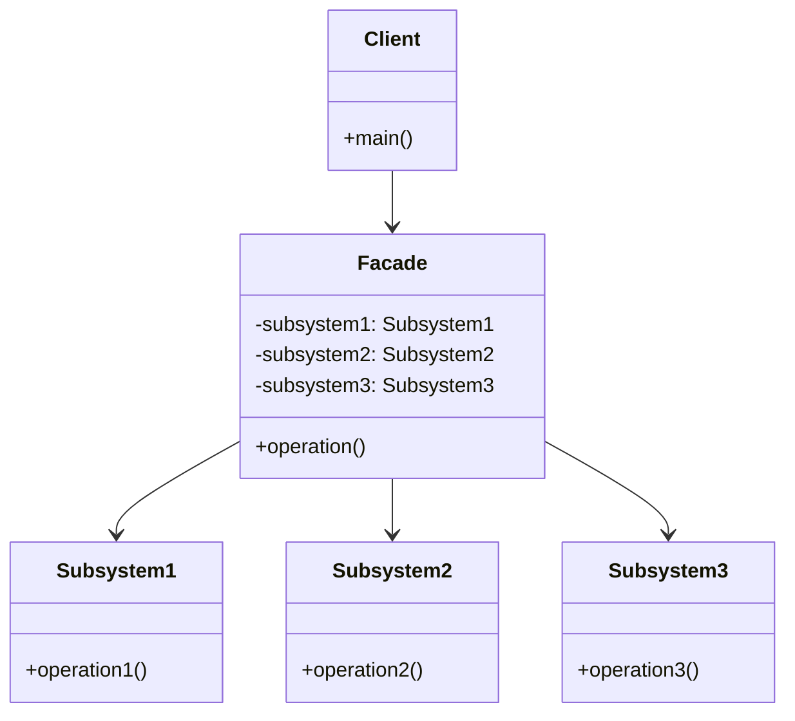
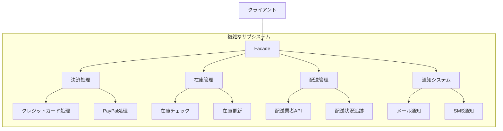

# Facade パターン

## 1. 基本構造



## 2. ユースケース図



## 3. TypeScript 実装例

### 3.1 基本的な Facade パターン

```typescript
// サブシステム1: 注文処理
class OrderSystem {
  validateOrder(orderId: string): boolean {
    console.log(`Validating order: ${orderId}`);
    return true;
  }

  processOrder(orderId: string): void {
    console.log(`Processing order: ${orderId}`);
  }
}

// サブシステム2: 支払い処理
class PaymentSystem {
  processPayment(orderId: string, amount: number): boolean {
    console.log(`Processing payment for order ${orderId}: $${amount}`);
    return true;
  }

  verifyPayment(orderId: string): boolean {
    console.log(`Verifying payment for order: ${orderId}`);
    return true;
  }
}

// サブシステム3: 在庫管理
class InventorySystem {
  checkStock(productId: string): boolean {
    console.log(`Checking stock for product: ${productId}`);
    return true;
  }

  updateStock(productId: string, quantity: number): void {
    console.log(`Updating stock for product ${productId}: -${quantity}`);
  }
}

// Facadeクラス
class OrderFacade {
  private orderSystem: OrderSystem;
  private paymentSystem: PaymentSystem;
  private inventorySystem: InventorySystem;

  constructor() {
    this.orderSystem = new OrderSystem();
    this.paymentSystem = new PaymentSystem();
    this.inventorySystem = new InventorySystem();
  }

  public processOrder(
    orderId: string,
    productId: string,
    amount: number
  ): boolean {
    console.log("Starting order processing...");

    // 注文の検証
    if (!this.orderSystem.validateOrder(orderId)) {
      console.log("Order validation failed");
      return false;
    }

    // 在庫確認
    if (!this.inventorySystem.checkStock(productId)) {
      console.log("Insufficient stock");
      return false;
    }

    // 支払い処理
    if (!this.paymentSystem.processPayment(orderId, amount)) {
      console.log("Payment processing failed");
      return false;
    }

    // 注文処理
    this.orderSystem.processOrder(orderId);
    this.inventorySystem.updateStock(productId, 1);

    console.log("Order processing completed successfully");
    return true;
  }
}

// 使用例
const facade = new OrderFacade();
facade.processOrder("ORD123", "PROD456", 99.99);
```

### 3.2 マルチメディア処理の実装例

```typescript
// 複雑なサブシステムのクラス群
class AudioSystem {
  loadAudio(file: string): void {
    console.log(`Loading audio: ${file}`);
  }

  decode(format: string): void {
    console.log(`Decoding audio format: ${format}`);
  }

  play(): void {
    console.log("Playing audio");
  }
}

class VideoSystem {
  loadVideo(file: string): void {
    console.log(`Loading video: ${file}`);
  }

  decode(codec: string): void {
    console.log(`Decoding video codec: ${codec}`);
  }

  play(): void {
    console.log("Playing video");
  }
}

class SubtitleSystem {
  loadSubtitles(file: string): void {
    console.log(`Loading subtitles: ${file}`);
  }

  sync(): void {
    console.log("Synchronizing subtitles");
  }
}

// Facade
class MediaPlayerFacade {
  private audio: AudioSystem;
  private video: VideoSystem;
  private subtitles: SubtitleSystem;

  constructor() {
    this.audio = new AudioSystem();
    this.video = new VideoSystem();
    this.subtitles = new SubtitleSystem();
  }

  playMovie(movieFile: string, subtitleFile: string): void {
    console.log("Starting movie playback...");

    this.video.loadVideo(movieFile);
    this.video.decode("H.264");

    this.audio.loadAudio(movieFile);
    this.audio.decode("AAC");

    this.subtitles.loadSubtitles(subtitleFile);
    this.subtitles.sync();

    this.video.play();
    this.audio.play();

    console.log("Movie is now playing");
  }
}

// 使用例
const mediaPlayer = new MediaPlayerFacade();
mediaPlayer.playMovie("movie.mp4", "subtitles.srt");
```

## 4. 主なユースケース

1. **複雑なライブラリの簡素化**

   - 複数の API の統合
   - 設定の一元管理
   - 機能の抽象化

2. **レガシーシステムのラッパー**

   - 古い API の modernization
   - 複雑な処理フローの隠蔽
   - システム統合の簡素化

3. **マルチステップ処理の統合**
   - 注文処理システム
   - メディア処理
   - バッチ処理

## 5. メリット

1. **複雑さの隠蔽**

   - シンプルなインターフェース提供
   - 依存関係の最小化
   - 使いやすさの向上

2. **保守性の向上**
   - 変更の影響範囲の限定
   - テストの容易さ
   - コードの再利用性

## 6. 実装時の注意点

### 6.1 インターフェース設計

```typescript
interface OrderProcessingFacade {
  processOrder(order: Order): Promise<OrderResult>;
  cancelOrder(orderId: string): Promise<boolean>;
  getOrderStatus(orderId: string): Promise<OrderStatus>;
}
```

### 6.2 エラーハンドリング

```typescript
class SafeOrderFacade implements OrderProcessingFacade {
  async processOrder(order: Order): Promise<OrderResult> {
    try {
      // 各サブシステムの処理
      return { success: true, orderId: "xxx" };
    } catch (error) {
      console.error("Order processing failed:", error);
      return { success: false, error: error.message };
    }
  }
}
```

### 6.3 非同期処理の適切な実装

```typescript
class AsyncOrderFacade {
  async processOrder(order: Order): Promise<OrderResult> {
    // 並列処理が可能な操作は並列実行
    const [inventoryCheck, paymentAuth] = await Promise.all([
      this.checkInventory(order.items),
      this.authorizePayment(order.payment),
    ]);

    // 順序が重要な処理は直列実行
    await this.processPayment(order.payment);
    await this.updateInventory(order.items);
    await this.sendConfirmation(order);

    return { success: true };
  }
}
```

## 7. アンチパターンを避ける

1. **過度な責任の集中を避ける**

```typescript
// 良くない例
class GiantFacade {
  doEverything(): void {
    // 多すぎる責任
  }
}

// 良い例
class OrderFacade {
  processOrder(): void {
    // 注文処理に関連する操作のみ
  }
}

class InventoryFacade {
  manageInventory(): void {
    // 在庫管理に関連する操作のみ
  }
}
```

2. **適切な抽象化レベルの維持**

```typescript
// 良くない例
class TooDetailedFacade {
  processOrderWithSpecificDetails(
    orderId: string,
    userId: string,
    productIds: string[],
    quantities: number[],
    paymentMethod: string,
    cardNumber: string,
    expiryDate: string,
    cvv: string
  ): void {
    // 詳細すぎる実装
  }
}

// 良い例
class WellDesignedFacade {
  processOrder(order: Order): void {
    // 適切な抽象化レベル
  }
}
```

Facade パターンは、複雑なシステムに対してシンプルなインターフェースを提供する強力なツールです。適切に使用することで、システムの使いやすさと保守性を大きく向上させることができます。
