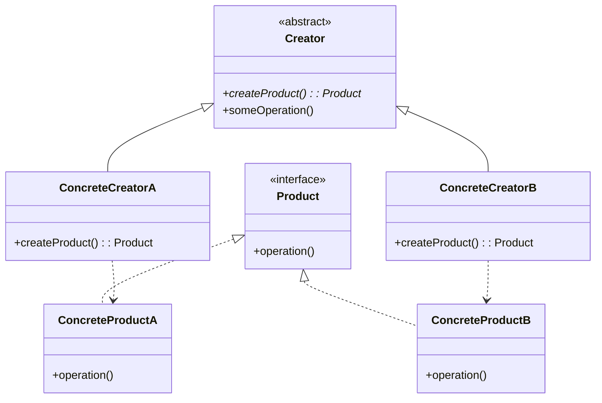
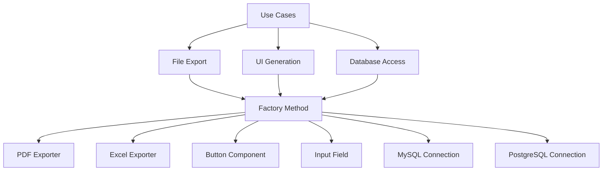

# Factory Method パターン

## 1. 基本構造



## 2. ユースケース図



## 3. TypeScript 実装例

### 3.1 ドキュメントエクスポートの例

```typescript
// Product: エクスポーター インターフェース
interface Exporter {
  export(data: any): string;
}

// Concrete Products: 具体的なエクスポーター実装
class PDFExporter implements Exporter {
  export(data: any): string {
    return `Exporting ${JSON.stringify(data)} as PDF`;
  }
}

class ExcelExporter implements Exporter {
  export(data: any): string {
    return `Exporting ${JSON.stringify(data)} as Excel`;
  }
}

// Creator: 抽象ファクトリークラス
abstract class ExporterFactory {
  // Factory Method
  abstract createExporter(): Exporter;

  // Template Method
  export(data: any): string {
    const exporter = this.createExporter();
    return exporter.export(data);
  }
}

// Concrete Creators: 具体的なファクトリー実装
class PDFExporterFactory extends ExporterFactory {
  createExporter(): Exporter {
    return new PDFExporter();
  }
}

class ExcelExporterFactory extends ExporterFactory {
  createExporter(): Exporter {
    return new ExcelExporter();
  }
}

// 使用例
const data = { name: "John Doe", age: 30 };

const pdfFactory = new PDFExporterFactory();
console.log(pdfFactory.export(data)); // "Exporting {"name":"John Doe","age":30} as PDF"

const excelFactory = new ExcelExporterFactory();
console.log(excelFactory.export(data)); // "Exporting {"name":"John Doe","age":30} as Excel"
```

## 4. 主なユースケース

1. **ドキュメント変換システム**

   - PDF エクスポート
   - Excel エクスポート
   - CSV エクスポート

2. **UI コンポーネント生成**

   - プラットフォーム固有のボタン
   - フォーム要素
   - ダイアログ

3. **データベース接続**
   - 異なるデータベースへの接続
   - 接続プールの管理
   - クエリビルダー

## 5. メリット

1. **カプセル化**

   - オブジェクト生成ロジックを集中管理
   - 製品の実装を隠蔽

2. **拡張性**

   - 新しい製品クラスの追加が容易
   - 既存コードの変更なしで機能追加可能

3. **テスト容易性**
   - モック・オブジェクトの作成が容易
   - 依存性の注入が簡単

## 6. 実装時の注意点

1. **適切な抽象化レベル**

   - 必要以上に複雑にしない
   - インターフェースをシンプルに保つ

2. **名前付けの規則**

   - わかりやすい命名を心がける
   - パターンの意図を反映した名前を使用

3. **エラー処理**
   - 生成失敗時の適切なエラーハンドリング
   - null/undefined の適切な処理
