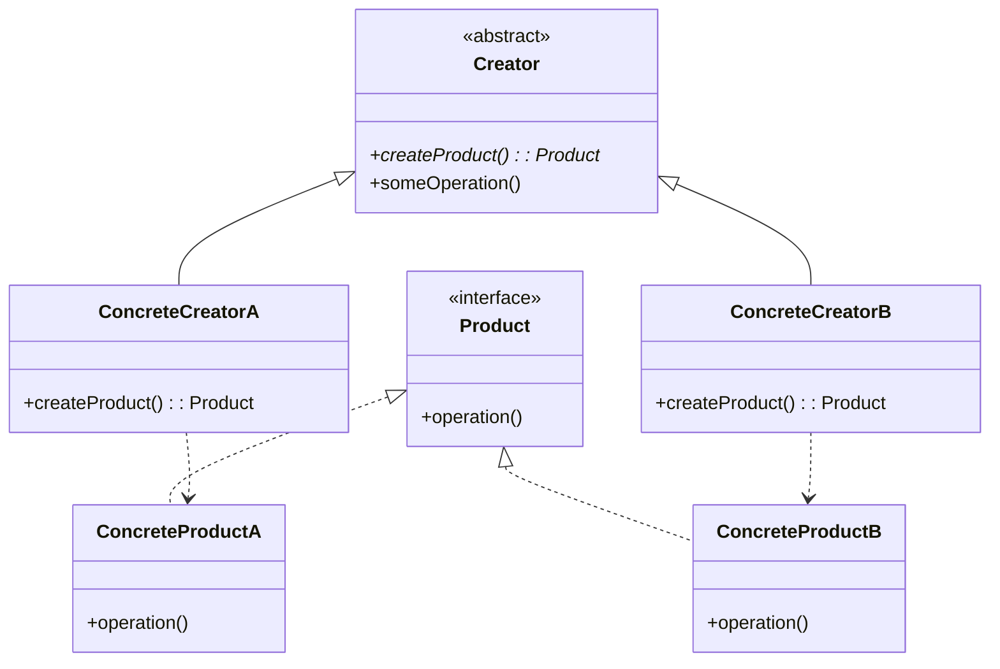

# Factory Method パターン

## 概要

Factory Method パターンは、オブジェクトの生成ロジックをサブクラスに委ねることで、オブジェクト生成の柔軟性を高めるデザインパターンです。

## クラス図



## ユースケース図

```mermaid
graph TB
    subgraph ユースケース
        UC1[ファイルエクスポート機能]
        UC2[UIコンポーネント生成]
        UC3[データベースコネクション]
    end

    subgraph Factory Method実装
        FM[Factory Method] --> PDF[PDFエクスポーター]
        FM --> Excel[Excelエクスポーター]
        FM --> Button[ボタンコンポーネント]
        FM --> Input[入力フィールド]
        FM --> MySQL[MySQLコネクション]
        FM --> Postgres[Postgresコネクション]
    end

    UC1 --> FM
    UC2 --> FM
    UC3 --> FM

    style ユースケース fill:#f9f,stroke:#333,stroke-width:2px
    style Factory Method実装 fill:#bbf,stroke:#333,stroke-width:2px
```

## 実装例（TypeScript）

### 1. ドキュメントエクスポートの例

```typescript
// Product: エクスポーター インターフェース
interface Exporter {
  export(data: any): string;
}

// Concrete Products: 具体的なエクスポーター実装
class PDFExporter implements Exporter {
  export(data: any): string {
    return `Exporting ${JSON.stringify(data)} as PDF`;
  }
}

class ExcelExporter implements Exporter {
  export(data: any): string {
    return `Exporting ${JSON.stringify(data)} as Excel`;
  }
}

// Creator: 抽象ファクトリークラス
abstract class ExporterFactory {
  // Factory Method
  abstract createExporter(): Exporter;

  // Template Method
  export(data: any): string {
    const exporter = this.createExporter();
    return exporter.export(data);
  }
}

// Concrete Creators: 具体的なファクトリー実装
class PDFExporterFactory extends ExporterFactory {
  createExporter(): Exporter {
    return new PDFExporter();
  }
}

class ExcelExporterFactory extends ExporterFactory {
  createExporter(): Exporter {
    return new ExcelExporter();
  }
}

// 使用例
const data = { name: "John Doe", age: 30 };

const pdfFactory = new PDFExporterFactory();
console.log(pdfFactory.export(data)); // "Exporting {"name":"John Doe","age":30} as PDF"

const excelFactory = new ExcelExporterFactory();
console.log(excelFactory.export(data)); // "Exporting {"name":"John Doe","age":30} as Excel"
```

### 2. UI コンポーネントの例

```typescript
// Product: ボタン インターフェース
interface Button {
  render(): string;
  onClick(): void;
}

// Concrete Products: プラットフォーム固有のボタン
class WindowsButton implements Button {
  render(): string {
    return "Rendering Windows style button";
  }

  onClick(): void {
    console.log("Windows button clicked");
  }
}

class MacButton implements Button {
  render(): string {
    return "Rendering macOS style button";
  }

  onClick(): void {
    console.log("macOS button clicked");
  }
}

// Creator: 抽象ダイアログクラス
abstract class Dialog {
  abstract createButton(): Button;

  render(): void {
    const button = this.createButton();
    console.log(button.render());
  }
}

// Concrete Creators: プラットフォーム固有のダイアログ
class WindowsDialog extends Dialog {
  createButton(): Button {
    return new WindowsButton();
  }
}

class MacDialog extends Dialog {
  createButton(): Button {
    return new MacButton();
  }
}

// 使用例
function createDialog(os: string): Dialog {
  if (os === "Windows") {
    return new WindowsDialog();
  } else {
    return new MacDialog();
  }
}

const windowsDialog = createDialog("Windows");
windowsDialog.render(); // "Rendering Windows style button"

const macDialog = createDialog("Mac");
macDialog.render(); // "Rendering macOS style button"
```

## メリット

1. **単一責任の原則に従う**

   - オブジェクトの生成ロジックを一箇所に集中させることができます
   - 製品のコードと生成のコードを分離できます

2. **オープン/クローズドの原則に従う**

   - 既存のコードを変更することなく、新しい種類の製品を追加できます

3. **柔軟性の向上**
   - 実行時に動的にオブジェクトの種類を決定できます
   - 環境やコンテキストに応じて適切なオブジェクトを生成できます

## ユースケース

1. **ドキュメント変換システム**

   - PDF エクスポーター
   - Excel エクスポーター
   - HTML エクスポーター

2. **クロスプラットフォーム UI**

   - Windows 向けコンポーネント
   - macOS 向けコンポーネント
   - Web 向けコンポーネント

3. **データベース接続**
   - MySQL 接続
   - PostgreSQL 接続
   - MongoDB 接続

## 実装時の注意点

1. **過度な抽象化を避ける**

   - 必要以上に複雑な階層構造を作らない
   - 実際に必要な機能に焦点を当てる

2. **命名規則の統一**

   - Creator（作成者）と Product（製品）の関係が分かりやすい命名を心がける
   - インターフェースと実装の命名の一貫性を保つ

3. **エラーハンドリング**
   - オブジェクト生成時の例外処理を適切に行う
   - 無効なパラメータや状態への対応を考慮する
