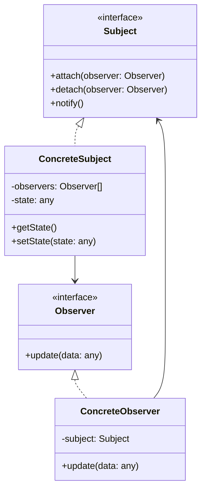
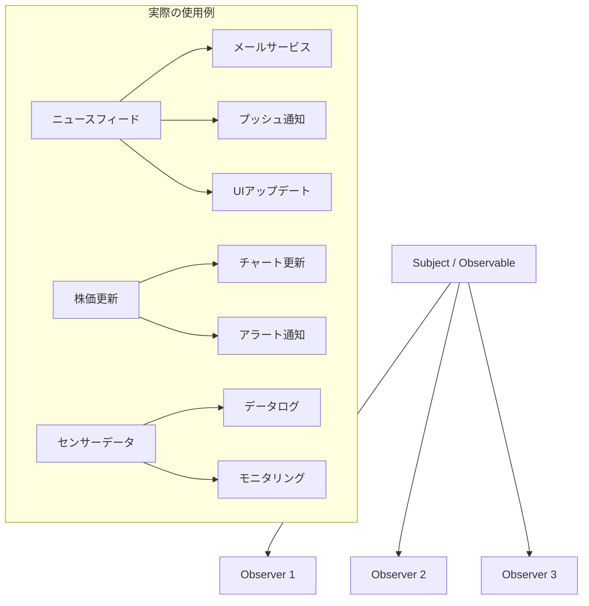

# Observer パターン

## 1. 基本構造



## 2. ユースケース図



## 3. TypeScript 実装例

### 3.1 基本的な Observer パターン

```typescript
// Observer インターフェース
interface Observer<T> {
  update(data: T): void;
}

// Subject インターフェース
interface Subject<T> {
  attach(observer: Observer<T>): void;
  detach(observer: Observer<T>): void;
  notify(data: T): void;
}

// 具体的なSubjectの実装
class NewsAgency implements Subject<string> {
  private observers: Observer<string>[] = [];

  public attach(observer: Observer<string>): void {
    const isExist = this.observers.includes(observer);
    if (!isExist) {
      this.observers.push(observer);
      console.log("Observer attached");
    }
  }

  public detach(observer: Observer<string>): void {
    const observerIndex = this.observers.indexOf(observer);
    if (observerIndex !== -1) {
      this.observers.splice(observerIndex, 1);
      console.log("Observer detached");
    }
  }

  public notify(data: string): void {
    console.log("Notifying observers...");
    for (const observer of this.observers) {
      observer.update(data);
    }
  }

  // ニュースを配信するメソッド
  public publishNews(news: string): void {
    console.log(`Publishing news: ${news}`);
    this.notify(news);
  }
}

// 具体的なObserverの実装
class NewsSubscriber implements Observer<string> {
  private name: string;

  constructor(name: string) {
    this.name = name;
  }

  public update(news: string): void {
    console.log(`${this.name} received news: ${news}`);
  }
}

// 使用例
const newsAgency = new NewsAgency();
const subscriber1 = new NewsSubscriber("Subscriber 1");
const subscriber2 = new NewsSubscriber("Subscriber 2");

newsAgency.attach(subscriber1);
newsAgency.attach(subscriber2);

newsAgency.publishNews("Breaking News!");
```

### 3.2 イベントエミッター型の実装

```typescript
class TypedEventEmitter<T extends { [K in keyof T]: any }> {
  private listeners: { [K in keyof T]?: ((data: T[K]) => void)[] } = {};

  public on<K extends keyof T>(event: K, listener: (data: T[K]) => void): void {
    if (!this.listeners[event]) {
      this.listeners[event] = [];
    }
    this.listeners[event]!.push(listener);
  }

  public off<K extends keyof T>(
    event: K,
    listener: (data: T[K]) => void
  ): void {
    if (!this.listeners[event]) return;

    const index = this.listeners[event]!.indexOf(listener);
    if (index !== -1) {
      this.listeners[event]!.splice(index, 1);
    }
  }

  public emit<K extends keyof T>(event: K, data: T[K]): void {
    if (!this.listeners[event]) return;

    this.listeners[event]!.forEach((listener) => listener(data));
  }
}

// 使用例
interface Events {
  userJoined: { userId: string; username: string };
  messageReceived: { message: string; timestamp: number };
  userLeft: { userId: string };
}

const chatRoom = new TypedEventEmitter<Events>();

chatRoom.on("userJoined", (data) => {
  console.log(`${data.username} joined the chat`);
});

chatRoom.emit("userJoined", {
  userId: "123",
  username: "John",
});
```

### 3.3 リアクティブな実装例

```typescript
class Observable<T> {
  private observers: ((value: T) => void)[] = [];

  constructor(private value: T) {}

  get(): T {
    return this.value;
  }

  set(newValue: T): void {
    if (this.value !== newValue) {
      this.value = newValue;
      this.notify();
    }
  }

  subscribe(observer: (value: T) => void): () => void {
    this.observers.push(observer);
    observer(this.value); // 初期値を通知

    // unsubscribe関数を返す
    return () => {
      const index = this.observers.indexOf(observer);
      if (index !== -1) {
        this.observers.splice(index, 1);
      }
    };
  }

  private notify(): void {
    for (const observer of this.observers) {
      observer(this.value);
    }
  }
}

// 使用例
const counter = new Observable<number>(0);

const unsubscribe = counter.subscribe((value) => {
  console.log(`Counter value: ${value}`);
});

counter.set(1); // "Counter value: 1"
counter.set(2); // "Counter value: 2"

unsubscribe(); // 購読を解除
```

## 4. 主なユースケース

1. **UI イベント処理**

   - ユーザーインタラクション
   - フォーム検証
   - 状態変更の反映

2. **システムイベント監視**

   - ログ監視
   - パフォーマンスモニタリング
   - エラー通知

3. **データ同期**
   - リアルタイムデータ更新
   - キャッシュ管理
   - 分散システムの同期

## 5. メリット

1. **疎結合の実現**

   - Subject と Observer の分離
   - 独立した変更が可能
   - テストの容易さ

2. **動的な関係性**
   - 実行時の Observer 追加/削除
   - 柔軟なイベント処理
   - スケーラブルな設計

## 6. 実装時の注意点

### 6.1 メモリリーク防止

```typescript
class SafeSubject<T> {
  private observers = new WeakSet<Observer<T>>();

  attach(observer: Observer<T>): void {
    this.observers.add(observer);
  }

  detach(observer: Observer<T>): void {
    this.observers.delete(observer);
  }
}
```

### 6.2 非同期処理の考慮

```typescript
class AsyncSubject<T> {
  private observers: Observer<T>[] = [];

  async notify(data: T): Promise<void> {
    const notifications = this.observers.map((observer) =>
      Promise.resolve().then(() => observer.update(data))
    );

    await Promise.all(notifications);
  }
}
```

### 6.3 エラーハンドリング

```typescript
class RobustSubject<T> {
  notify(data: T): void {
    for (const observer of this.observers) {
      try {
        observer.update(data);
      } catch (error) {
        console.error("Observer update failed:", error);
        // エラーログの記録やフォールバック処理
      }
    }
  }
}
```

## 7. 発展的な実装パターン

### 7.1 優先順位付き Observer

```typescript
interface PriorityObserver<T> extends Observer<T> {
  priority: number;
}

class PrioritySubject<T> {
  private observers: PriorityObserver<T>[] = [];

  notify(data: T): void {
    // 優先順位でソートして通知
    this.observers
      .sort((a, b) => b.priority - a.priority)
      .forEach((observer) => observer.update(data));
  }
}
```

### 7.2 フィルタリング機能付き Observer

```typescript
class FilteredObservable<T> {
  private observers: { observer: Observer<T>; filter: (data: T) => boolean }[] =
    [];

  attach(observer: Observer<T>, filter: (data: T) => boolean): void {
    this.observers.push({ observer, filter });
  }

  notify(data: T): void {
    this.observers.forEach(({ observer, filter }) => {
      if (filter(data)) {
        observer.update(data);
      }
    });
  }
}
```

Observer パターンは、イベント駆動型のシステムにおいて非常に重要な役割を果たします。適切に実装することで、柔軟で保守性の高いシステムを構築できます。
