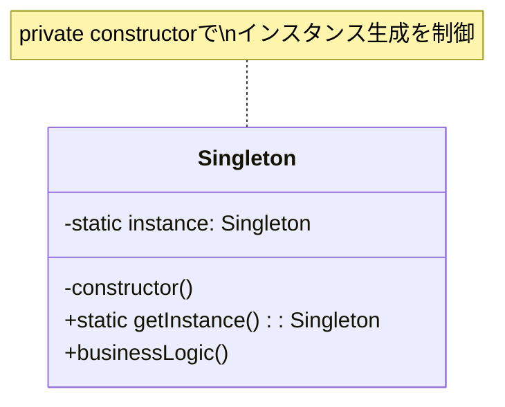
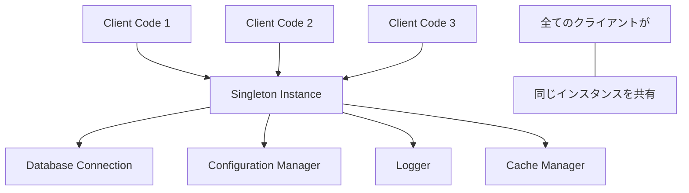

# Singleton パターン

## 1. 基本構造


## 2. ユースケース図


## 3. TypeScript実装例

### 3.1 基本的な実装
```typescript
class BasicSingleton {
    private static instance: BasicSingleton;
    private constructor() {}

    public static getInstance(): BasicSingleton {
        if (!BasicSingleton.instance) {
            BasicSingleton.instance = new BasicSingleton();
        }
        return BasicSingleton.instance;
    }

    public someBusinessLogic() {
        // ビジネスロジックの実装
    }
}

// 使用例
const instance1 = BasicSingleton.getInstance();
const instance2 = BasicSingleton.getInstance();
console.log(instance1 === instance2); // true
```

### 3.2 データベース接続の例
```typescript
class DatabaseConnection {
    private static instance: DatabaseConnection;
    private connection: any; // 実際のデータベース接続オブジェクト

    private constructor() {
        this.connection = null;
    }

    public static getInstance(): DatabaseConnection {
        if (!DatabaseConnection.instance) {
            DatabaseConnection.instance = new DatabaseConnection();
        }
        return DatabaseConnection.instance;
    }

    public connect(config: { host: string; port: number; username: string; password: string }) {
        if (!this.connection) {
            // 実際のデータベース接続処理
            this.connection = {
                host: config.host,
                port: config.port,
                username: config.username,
                lastConnected: new Date()
            };
            console.log('New database connection established');
        }
        return this.connection;
    }

    public query(sql: string): any {
        if (!this.connection) {
            throw new Error('Database not connected');
        }
        console.log(`Executing query: ${sql}`);
        // 実際のクエリ実行ロジック
    }

    public disconnect(): void {
        if (this.connection) {
            // 接続のクリーンアップ
            this.connection = null;
            console.log('Database disconnected');
        }
    }
}

// 使用例
const db1 = DatabaseConnection.getInstance();
const db2 = DatabaseConnection.getInstance();

db1.connect({
    host: 'localhost',
    port: 5432,
    username: 'admin',
    password: 'password'
});

db1.query('SELECT * FROM users');
// db2は同じ接続を使用する
db2.query('SELECT * FROM products');
```

### 3.3 設定管理の例
```typescript
class ConfigManager {
    private static instance: ConfigManager;
    private settings: Map<string, any>;

    private constructor() {
        this.settings = new Map();
        this.loadDefaultSettings();
    }

    public static getInstance(): ConfigManager {
        if (!ConfigManager.instance) {
            ConfigManager.instance = new ConfigManager();
        }
        return ConfigManager.instance;
    }

    private loadDefaultSettings(): void {
        this.settings.set('theme', 'light');
        this.settings.set('language', 'en');
        this.settings.set('notifications', true);
    }

    public getSetting(key: string): any {
        return this.settings.get(key);
    }

    public setSetting(key: string, value: any): void {
        this.settings.set(key, value);
    }

    public getAllSettings(): Map<string, any> {
        return new Map(this.settings);
    }
}

// 使用例
const config = ConfigManager.getInstance();
config.setSetting('theme', 'dark');

const config2 = ConfigManager.getInstance();
console.log(config2.getSetting('theme')); // 'dark'
```

## 4. 主なユースケース

1. **共有リソースの管理**
   - データベース接続プール
   - ファイルシステムアクセス
   - ネットワークソケット

2. **グローバル状態の管理**
   - アプリケーション設定
   - ユーザー設定
   - セッション情報

3. **ユーティリティサービス**
   - ロギング
   - キャッシュ
   - 認証サービス

## 5. メリット

1. **リソースの効率的な使用**
   - メモリ使用の最適化
   - リソースの競合防止
   - 一貫した状態管理

2. **グローバルアクセス**
   - アプリケーション全体からのアクセス
   - 状態の共有が容易
   - 一貫したインターフェース

## 6. 実装時の注意点

1. **スレッドセーフティ**
```typescript
class ThreadSafeSingleton {
    private static instance: ThreadSafeSingleton;
    private static isCreating: boolean = false;

    private constructor() {
        if (!ThreadSafeSingleton.isCreating) {
            throw new Error('Singleton instance cannot be created directly');
        }
    }

    public static getInstance(): ThreadSafeSingleton {
        if (!ThreadSafeSingleton.instance) {
            ThreadSafeSingleton.isCreating = true;
            ThreadSafeSingleton.instance = new ThreadSafeSingleton();
            ThreadSafeSingleton.isCreating = false;
        }
        return ThreadSafeSingleton.instance;
    }
}
```

2. **テスト容易性**
   - モック化の方法を考慮
   - テスト用のインスタンス置き換え機能を検討

3. **lazy loading**
```typescript
class LazySingleton {
    private static instance: LazySingleton;
    private data: any;

    private constructor() {
        // 重い初期化処理
        this.data = new Array(1000000).fill(0);
    }

    public static getInstance(): LazySingleton {
        if (!LazySingleton.instance) {
            console.log('Creating new instance');
            LazySingleton.instance = new LazySingleton();
        }
        return LazySingleton.instance;
    }
}
```

## 7. アンチパターンとしての側面

Singletonパターンは、以下の理由から慎重に使用する必要があります：

1. **グローバル状態**
   - テストの難しさ
   - 状態管理の複雑化
   - 依存関係の不透明化

2. **代替案の検討**
   - 依存性注入の使用
   - コンテキストの利用
   - サービスロケーターパターン