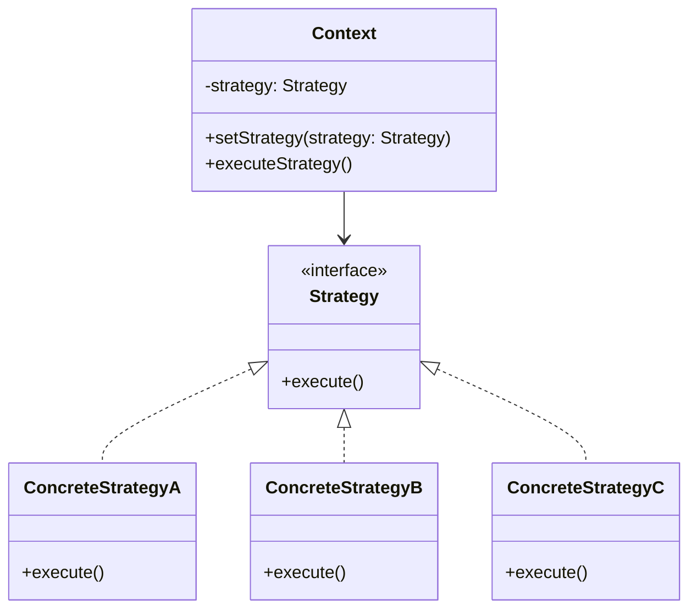
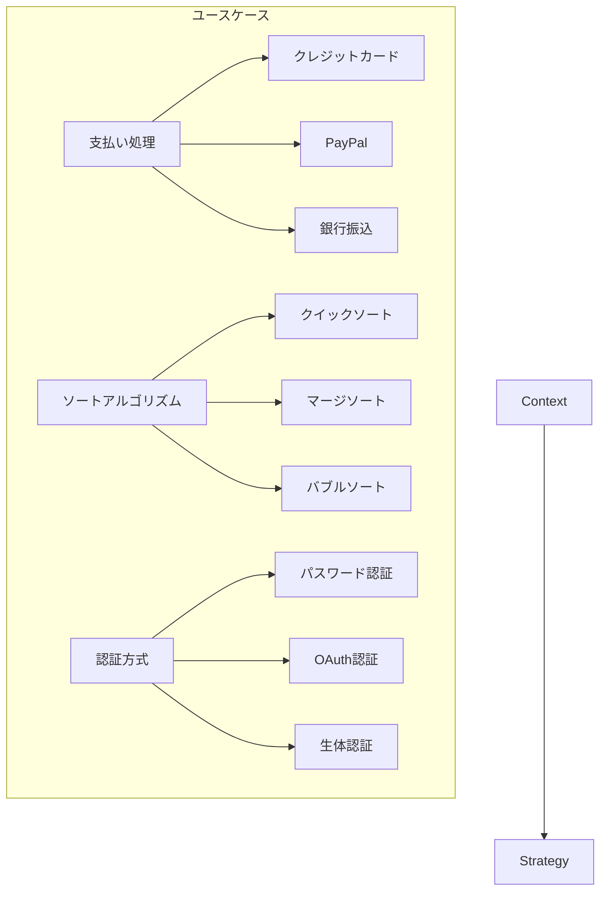

# Strategy パターン

## 1. 基本構造



## 2. ユースケース図



## 3. TypeScript 実装例

### 3.1 支払い処理の例

```typescript
// 支払い戦略のインターフェース
interface PaymentStrategy {
  pay(amount: number): void;
  validate(): boolean;
}

// クレジットカード支払い戦略
class CreditCardStrategy implements PaymentStrategy {
  constructor(
    private cardNumber: string,
    private expiryDate: string,
    private cvv: string
  ) {}

  validate(): boolean {
    // カード情報の検証ロジック
    return this.cardNumber.length === 16 && this.cvv.length === 3;
  }

  pay(amount: number): void {
    if (this.validate()) {
      console.log(`Paying ${amount} using Credit Card`);
    } else {
      throw new Error("Invalid card details");
    }
  }
}

// PayPal支払い戦略
class PayPalStrategy implements PaymentStrategy {
  constructor(private email: string, private password: string) {}

  validate(): boolean {
    // PayPal認証情報の検証ロジック
    return this.email.includes("@") && this.password.length >= 8;
  }

  pay(amount: number): void {
    if (this.validate()) {
      console.log(`Paying ${amount} using PayPal`);
    } else {
      throw new Error("Invalid PayPal credentials");
    }
  }
}

// 支払いコンテキスト
class PaymentContext {
  private strategy: PaymentStrategy;

  setStrategy(strategy: PaymentStrategy) {
    this.strategy = strategy;
  }

  processPayment(amount: number) {
    if (!this.strategy) {
      throw new Error("Payment strategy not set");
    }
    this.strategy.pay(amount);
  }
}

// 使用例
const paymentContext = new PaymentContext();

// クレジットカード支払い
const creditCardStrategy = new CreditCardStrategy(
  "1234567890123456",
  "12/24",
  "123"
);
paymentContext.setStrategy(creditCardStrategy);
paymentContext.processPayment(100);

// PayPal支払い
const paypalStrategy = new PayPalStrategy("user@example.com", "password123");
paymentContext.setStrategy(paypalStrategy);
paymentContext.processPayment(100);
```

### 3.2 ソートアルゴリズムの例

```typescript
// ソート戦略のインターフェース
interface SortStrategy<T> {
  sort(data: T[]): T[];
}

// クイックソート戦略
class QuickSortStrategy<T> implements SortStrategy<T> {
  sort(data: T[]): T[] {
    if (data.length <= 1) return data;

    const pivot = data[0];
    const left = data.slice(1).filter((item) => item <= pivot);
    const right = data.slice(1).filter((item) => item > pivot);

    return [...this.sort(left), pivot, ...this.sort(right)];
  }
}

// バブルソート戦略
class BubbleSortStrategy<T> implements SortStrategy<T> {
  sort(data: T[]): T[] {
    const arr = [...data];
    const n = arr.length;

    for (let i = 0; i < n - 1; i++) {
      for (let j = 0; j < n - i - 1; j++) {
        if (arr[j] > arr[j + 1]) {
          [arr[j], arr[j + 1]] = [arr[j + 1], arr[j]];
        }
      }
    }

    return arr;
  }
}

// ソートコンテキスト
class Sorter<T> {
  constructor(private strategy: SortStrategy<T>) {}

  setStrategy(strategy: SortStrategy<T>) {
    this.strategy = strategy;
  }

  sort(data: T[]): T[] {
    return this.strategy.sort(data);
  }
}

// 使用例
const numbers = [64, 34, 25, 12, 22, 11, 90];
const sorter = new Sorter<number>(new QuickSortStrategy());
console.log("QuickSort:", sorter.sort(numbers));

sorter.setStrategy(new BubbleSortStrategy());
console.log("BubbleSort:", sorter.sort(numbers));
```

### 3.3 認証戦略の例

```typescript
interface AuthenticationStrategy {
  authenticate(credentials: unknown): Promise<boolean>;
}

class PasswordStrategy implements AuthenticationStrategy {
  async authenticate(credentials: {
    username: string;
    password: string;
  }): Promise<boolean> {
    // パスワード認証のロジック
    return credentials.password.length >= 8;
  }
}

class OAuthStrategy implements AuthenticationStrategy {
  async authenticate(credentials: { token: string }): Promise<boolean> {
    // OAuth認証のロジック
    return credentials.token.length > 0;
  }
}

class BiometricStrategy implements AuthenticationStrategy {
  async authenticate(credentials: { biometricData: Buffer }): Promise<boolean> {
    // 生体認証のロジック
    return credentials.biometricData.length > 0;
  }
}

class AuthenticationContext {
  constructor(private strategy: AuthenticationStrategy) {}

  setStrategy(strategy: AuthenticationStrategy) {
    this.strategy = strategy;
  }

  async authenticate(credentials: unknown): Promise<boolean> {
    return await this.strategy.authenticate(credentials);
  }
}
```

## 4. 主なユースケース

1. **アルゴリズムの動的切り替え**

   - ソートアルゴリズム
   - 検索アルゴリズム
   - 暗号化アルゴリズム

2. **ビジネスロジックの切り替え**

   - 支払い処理
   - 割引計算
   - 配送方法

3. **認証・認可**
   - 認証方式
   - アクセス制御
   - セッション管理

## 5. メリット

1. **カプセル化**

   - アルゴリズムの実装を隠蔽
   - コードの再利用性向上
   - テストの容易さ

2. **柔軟性**
   - 実行時のアルゴリズム切り替え
   - 新しいアルゴリズムの追加が容易
   - 既存コードへの影響を最小化

## 6. 実装時の注意点

### 6.1 型安全性の確保

```typescript
// 型安全な戦略パターン
interface Strategy<TInput, TOutput> {
  execute(input: TInput): TOutput;
}

class Context<TInput, TOutput> {
  constructor(private strategy: Strategy<TInput, TOutput>) {}

  execute(input: TInput): TOutput {
    return this.strategy.execute(input);
  }
}
```

### 6.2 パフォーマンスの考慮

```typescript
class CachedStrategy<T> implements SortStrategy<T> {
    private cache = new Map<string, T[]>();

    sort(data: T[]): T[] {
        const key = JSON.stringify(data);
        if (this.cache.has(key)) {
            return this.cache.get(key)!;
        }

        const result = /* sorting logic */;
        this.cache.set(key, result);
        return result;
    }
}
```

### 6.3 エラーハンドリング

```typescript
class SafeStrategy implements PaymentStrategy {
  async pay(amount: number): Promise<void> {
    try {
      // 支払い処理
      await this.processPayment(amount);
    } catch (error) {
      // エラーログの記録
      console.error("Payment failed:", error);
      // 適切なフォールバック処理
      throw new PaymentError("Payment processing failed", error);
    }
  }
}
```

## 7. アンチパターンを避ける

1. **過度な抽象化**

```typescript
// 悪い例：不必要に複雑な階層構造
interface Strategy {}
interface SubStrategy extends Strategy {}
interface SubSubStrategy extends SubStrategy {}

// 良い例：シンプルな階層構造
interface PaymentStrategy {
  pay(amount: number): Promise<void>;
}
```

2. **コンテキストの肥大化**

```typescript
// 悪い例：コンテキストに過度な責任
class PaymentContext {
    private strategy: PaymentStrategy;
    private logger: Logger;
    private validator: Validator;
    private notifier: Notifier;
    // ...多すぎる責任

    // 良い例：単一責任の原則に従う
    class PaymentContext {
        constructor(private strategy: PaymentStrategy) {}
        process(amount: number) {
            return this.strategy.pay(amount);
        }
    }
}
```

Strategy パターンは、アルゴリズムの切り替えを柔軟に行うための強力なツールです。適切に使用することで、保守性と拡張性の高いコードを実現できます。
